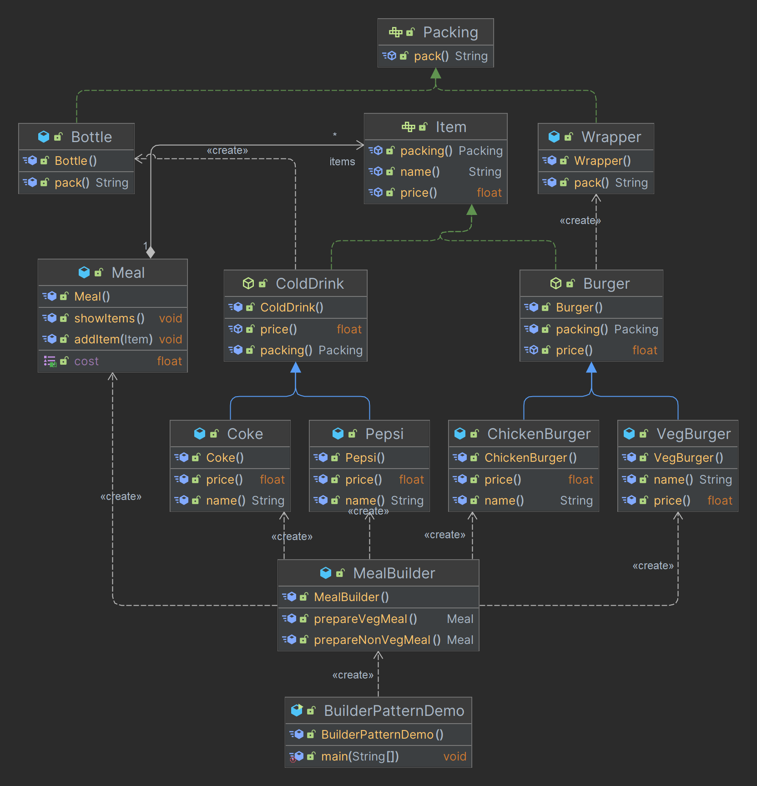

# Design-Patterns

A design patterns are well-proved solution for solving the specific problem/task.

[](https://wakatime.com/badge/user/bde2acba-42bd-46e8-a905-d74c6f260407/project/93512f37-50d9-41ad-845d-15440dc23897)



### 1. Creational Design Pattern
* Singleton Pattern
* Factory Pattern
* Object Pool
* Abstract Factory Pattern
* ***Prototype Pattern***
* Builder Pattern

### **Prototype Pattern**
Prototype Pattern says that ***cloning of an existing object instead of creating new one and can also be customized as per the requirement.***

This pattern should be followed, if the cost of creating a new object is expensive and resource intensive.


## - **Create New Branch and Push It**

* `git checkout -b <your-new-branch>`
* `git add .`
* `git commit -m <message>`
* `git push --set-upstream origin <your-new-branch>`

## - **Move to Branches**

* `git add .`
* `git stash`
* `git checkout <your-new-branch>`

###    

### **Clone this repository** ✅

```md
https://github.com/NimeshPiyumantha/Design-Patterns.git
```

## Connect with me

#### If you have any bugs or issues , If you want to explain my code please contact me on :

<div align="center">
 <br><b>MAIL ME</b>&nbsp;
  <a href="mailto:nimeshpiyumantha11@gmail.com">
      
  </a></p>

 </div>

##

<p align="center">
<a href="https://twitter.com/NPiyumantha60"></a>
<a href="https://www.linkedin.com/in/nimesh-piyumantha-33736a222" target="blank"></a>
<a href="https://www.facebook.com/profile.php?id=100025931563090" target="blank"></a>
<a href="https://www.instagram.com/_.nimmaa._/" target="blank"></a>
</p>

##

<div align="center">


</div>

<div align="center">

#### @2023 [Nimesh Piyumantha](https://github.com/NimeshPiyumantha/), Inc.All rights reserved

</div>
